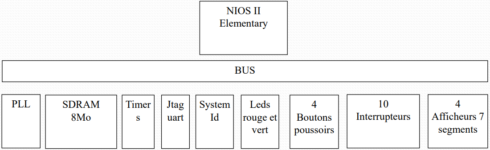
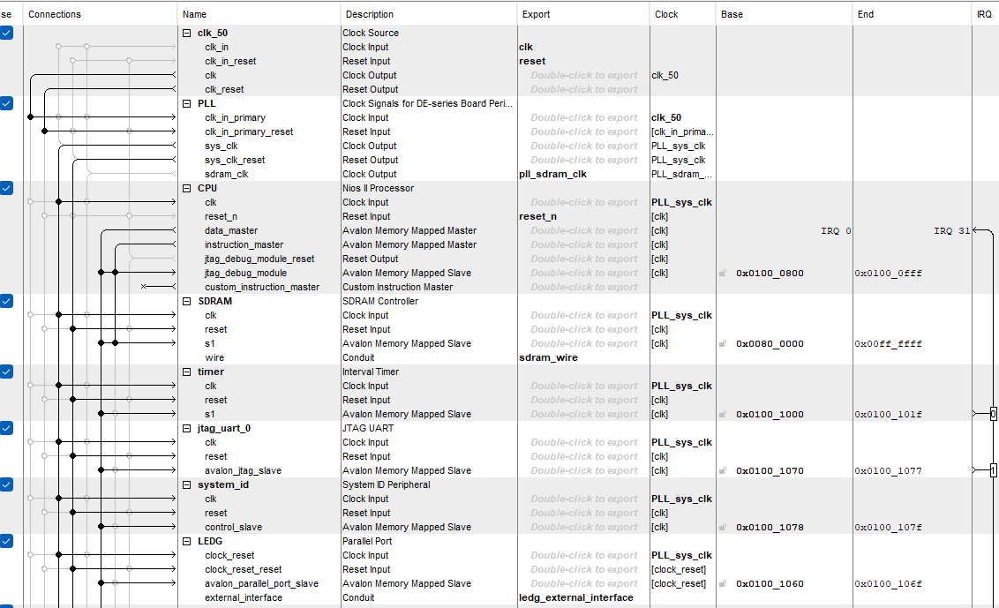
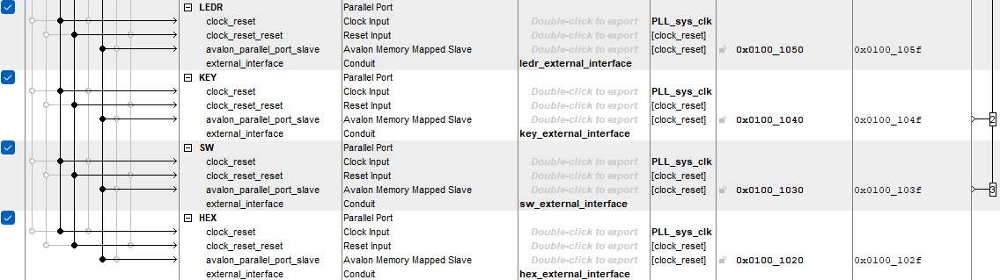

# DE1 Smartwatch Project

This project implements a digital watch and stopwatch system on the Altera DE1 development board, featuring the NIOS II processor. The system utilizes various components such as SDRAM, UART, and multiple I/O devices (LEDs, buttons, switches, 7-segment displays, and a timer).

## System Overview

### Key Components:

### Description of Inputs and Outputs:

#### Push Buttons:

* **KEY0**: Reset the system.
* **Watch Mode**: 
  * **KEY1**: Incrementing hours/minutes.
  * **KEY2**: Decrementing hours/minutes.
  * **KEY3**: swtching from adjusting hours <-> minutes.
* **Stopwatch Mode**:
  * **KEY1**: Start the stopwatch.
  * **KEY2**: Pause the stopwatch.
  * **KEY3**: Stop the stopwatch.

#### Switches:

* **SW0**: switching from Watch mode <-> Stopwatch mode.
* **SW1**: switching from Adjust time <-> only Display time.

#### 7-Segment Displays:

* **Watch Mode**: Displays the time (hour on 2 displays, minute on 2 displays).
* **Stopwatch Mode**: Displays the elapsed time (minute on 2 displays, second on 2 displays).

### System Features:

* **Time Management**: The system keeps track of time in hours and minutes and displays it on the 7-segment displays.
* **Stopwatch Functionality**: Users can start, pause, and stop a stopwatch to measure elapsed time in minutes and seconds.
* **Display Switching**: The system allows toggling between the current time and the stopwatch view using switches.

### Hardware Requirements:

* **Altera DE1 Board** (with NIOS II processor)

### Software Overview:

The project uses the NIOS II processor and integrates with the peripherals (LEDs, buttons, switches, 7-segment displays, and timers) to implement the digital watch and stopwatch functionality.

### Qsys Wiring:

### Future Improvements:

* Adding more functionalities such as alarm settings or countdown timers.
